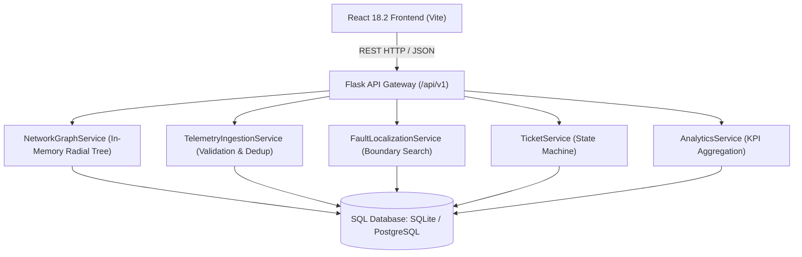
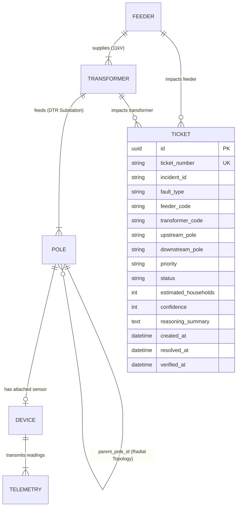
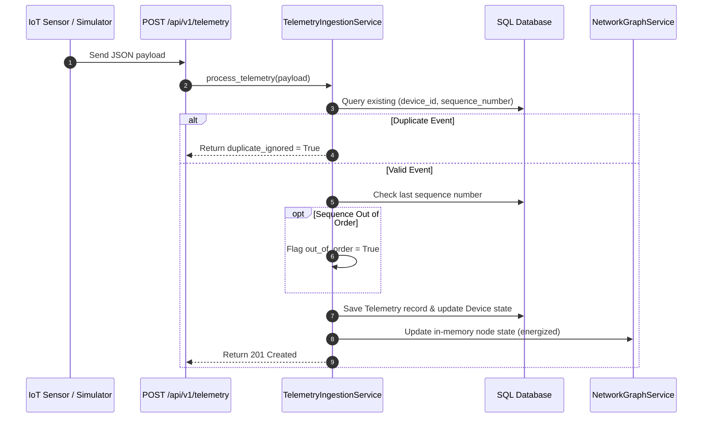

# System Architecture & Design

This document describes the system architecture, entity relationships, graph topology structures, and sequence workflows for the Propel AI Fault Detection and Management System.

---

## System Overview

The system is structured as a two-tier application: a Flask REST API backend and a React single-page frontend.

---

## Backend Architecture

The backend follows Flask's application factory pattern (`create_app`) located in `backend/app/__init__.py`. 

- **Routes (`backend/app/routes/`)**: Exposes modular REST endpoints registered via Blueprints under the `/api/v1` prefix.
- **Services (`backend/app/services/`)**: Encapsulates core domain business logic. Services operate on database models and maintain in-memory topology state.
- **Models (`backend/app/models/`)**: Defines SQLAlchemy ORM entities mapping grid assets, telemetry events, and repair tickets.
- **Middleware & Utils (`backend/app/middleware/`, `backend/app/utils/`)**: Provides centralized exception handling, JSON error formatting, and request logging.

---

## Frontend Architecture

The frontend is a single-page application built with React 18.2, Vite 5.4, and Tailwind CSS 3.4.

- **Routes (`src/routes/AppRoutes.jsx`)**: Declares application paths (`/`, `/poles`, `/network-explorer`, `/telemetry`, `/faults`, `/tickets`, `/simulator`, `/analytics`, `/settings`).
- **Layouts (`src/layouts/MainLayout.jsx`)**: Provides navigation layout wrapping page components.
- **API Client (`src/services/api.js`)**: Configures an Axios instance with base URL `http://localhost:5000/api/v1`, 10-second request timeouts, and error interceptors.
- **Pages & Components (`src/pages/`, `src/components/`)**: Renders reactive interfaces using Tailwind CSS cards, tables, and icons from `react-icons/fi`.

---

## Database Schema Overview

The relational database schema models grid domain entities and work order lifecycles.

### Models Summary

1. **Feeder**: Represents an 11kV distribution line originating from a substation.
2. **Transformer**: Represents a Distribution Transformer (DTR) stepped down to low voltage.
3. **Pole**: Represents an electrical pole. Contains self-referencing foreign key `parent_pole_id` to establish radial distribution chains.
4. **Device**: Physical IoT sensor unit mounted on a pole (tracks `energized`, `battery_mv`, `last_rssi`, `last_seen`).
5. **Telemetry**: Raw event stream log storing `device_id`, `sequence_number`, `voltage_v`, `current_a`, `energized`, and sequence lag markers.
6. **Ticket**: Repair work order tracking outage incidents, priority levels, confidence scores, and lifecycle state changes.

---

## Data Flow & Workflows

### 1. Telemetry Ingestion Flow

### 2. Deterministic Fault Localization Algorithm

The `FaultLocalizationService` scans the in-memory `NetworkGraphService` to detect line breaks:

1. **Transformer Fault (`TRANSFORMER_FAULT`)**: Checked first. If 100% of instrumented poles under a Distribution Transformer are dark (`energized = False`), a transformer substation outage is flagged.
2. **Feeder Fault (`FEEDER_FAULT`)**: If 100% of poles across all transformers under a Feeder line are dark, a feeder trip is flagged.
3. **Span Fault (`SPAN_FAULT`)**: Scans parent-child pole pairs. If an upstream parent pole $A$ is `energized = True` and its downstream child pole $B$ is `energized = False`, a line break is isolated between Pole $A$ and Pole $B$.
4. **Sensor Anomaly Suppression**: If a parent pole is dark but any downstream child pole remains energized, the dark parent is marked as a sensor false positive rather than a physical line break.
5. **Unknown Span Fallback (`UNKNOWN_SPAN`)**: Unlinked poles (`parent_pole_id = None`) reporting dark status are isolated as unknown span incidents.

### 3. Repair Ticket Generation & State Machine

When a fault incident is identified, `TicketService` creates a work order ticket:

- **State Machine Transitions**: `NEW` → `ACKNOWLEDGED` → `ASSIGNED` → `RESOLVED` → `VERIFIED` → `CLOSED`.
- **Auto-Verification**: When a ticket status is moved to `RESOLVED`, the system allows automated verification (`POST /api/v1/tickets/:id/auto-verify`). It queries the live network graph for all affected poles. If live telemetry confirms power is restored across the span, the ticket automatically transitions to `VERIFIED`.

### 4. Simulator Workflow

The `SimulatorService` enables scenario testing:

1. Preset scenarios (e.g., `SPAN_FAULT_BRANCH`, `TRANSFORMER_FAULT`, `FEEDER_TRIP`, `SENSOR_ANOMALY`) generate synthetic telemetry packets.
2. Payloads are passed through `TelemetryIngestionService`, maintaining exact business logic and database writes.
3. `FaultLocalizationService` analyzes the updated graph.
4. `TicketService` generates work orders for isolated incidents.

### 5. Analytics Workflow

`AnalyticsService` calculates metrics on demand:
- **KPI Metrics**: Total poles, active faults, open tickets, network health percentage (`energized_devices / total_active_devices * 100`).
- **Reliability Metrics**: Mean Time To Resolution (MTTR) calculated from ticket `created_at` and `resolved_at` timestamps.

---

## Confidence Scoring Engine (AI / Rule Reasoning)

To avoid non-deterministic errors from Large Language Models during critical utility operations, confidence scores are computed deterministically using mathematical deduction rules:

$$\text{Confidence} = 100 - \Delta_{\text{topology}} - \Delta_{\text{sensor\_gap}} - \Delta_{\text{sequence\_lag}}$$

- **Base Score**: 100%
- **Unknown Topology Deduction ($\Delta_{\text{topology}}$)**: -25% if parent pole is unknown (`parent_pole_id = None`).
- **Uninstrumented Sensor Gap ($\Delta_{\text{sensor\_gap}}$)**: -15% if unmetered poles exist along the affected span.
- **Sequence Lag Deduction ($\Delta_{\text{sequence\_lag}}$)**: -10% if telemetry arrived out of sequence order.

A reasoning generator generates clear diagnostic arrays explaining each deduction step.

---

## Complexity Analysis

| Operation | Service / Method | Time Complexity | Space Complexity |
| :--- | :--- | :--- | :--- |
| **Node Lookup** | `NetworkGraphService.get_pole()` | $O(1)$ | $O(V)$ |
| **Root Path Traversal** | `NetworkGraphService.get_path_to_transformer()` | $O(h)$ | $O(h)$ |
| **Subtree Descendants Search** | `NetworkGraphService.get_descendants()` | $O(V_{subtree})$ | $O(V_{subtree})$ |
| **Fault Boundary Analysis** | `FaultLocalizationService.analyze_network()` | $O(V + E)$ | $O(V)$ |
| **Telemetry Ingestion & Validation** | `TelemetryIngestionService.process_telemetry()` | $O(1)$ | $O(1)$ |

*Where $V$ is the number of network nodes, $E$ is the number of topology edges, and $h$ is the tree height.*

---

## Technical Limitations

1. **Single-Process In-Memory Graph**: The `NetworkGraphService` builds its graph structure in memory during startup. In multi-worker production deployments (e.g., Gunicorn with multiple worker processes), graph state changes must be synchronized via an external cache like Redis.
2. **SQLite Concurrency Limits**: Development SQLite databases lock during high-concurrency bulk telemetry writes. PostgreSQL must be used for production environments.
3. **No Dynamic WebSockets**: Telemetry updates are currently fetched via periodic HTTP polling rather than WebSocket streams.
