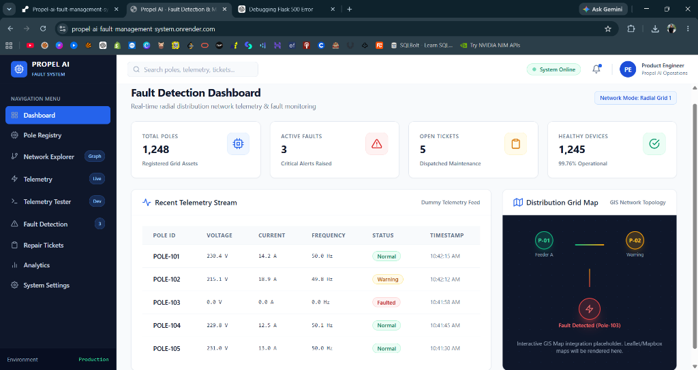
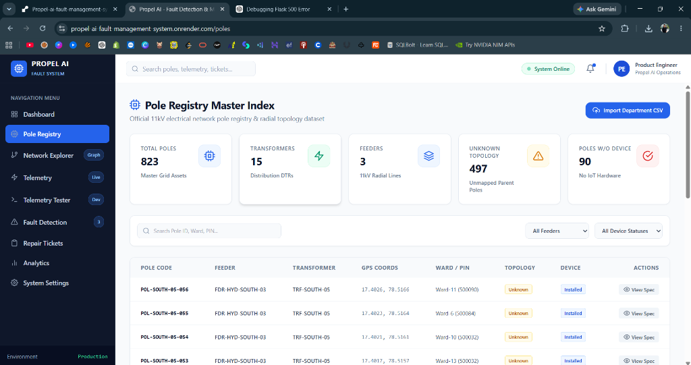
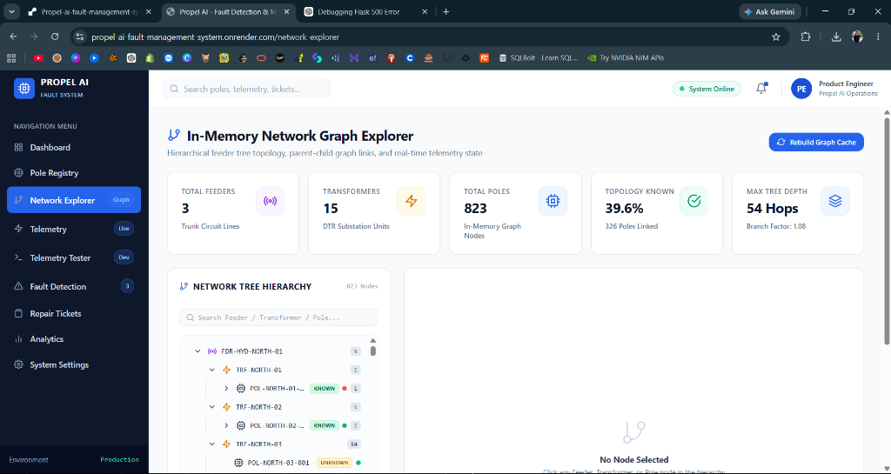
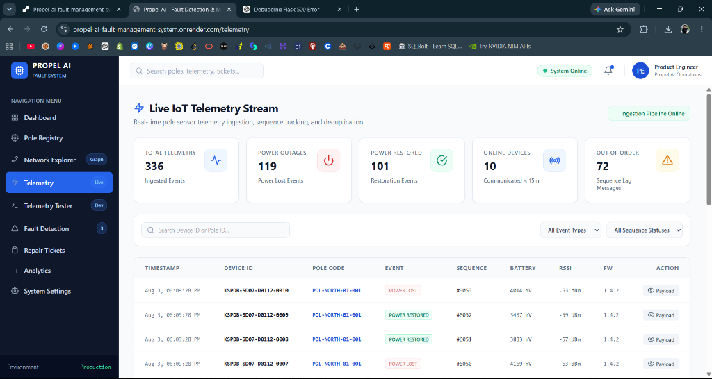
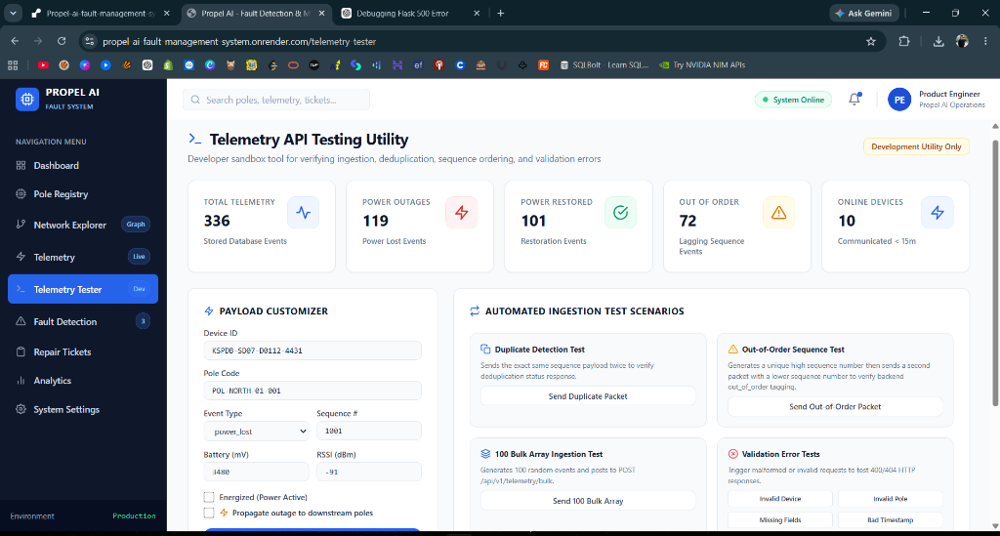
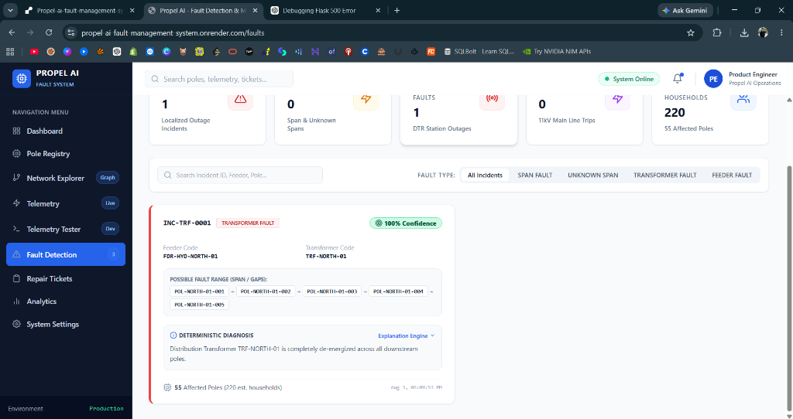
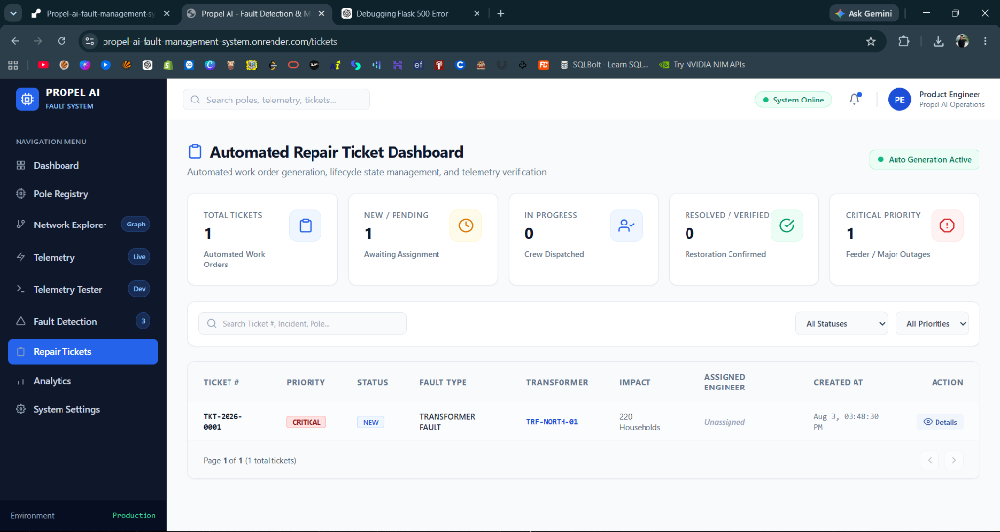
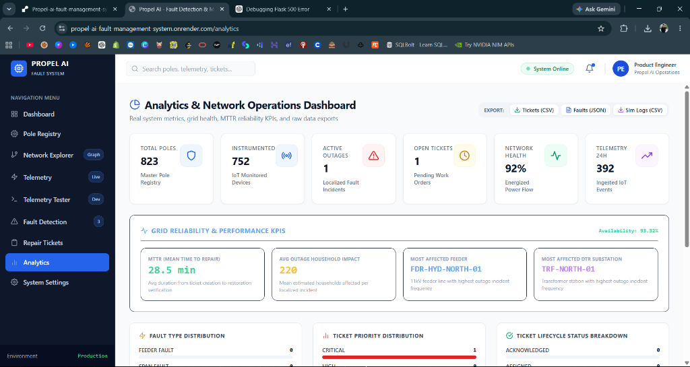
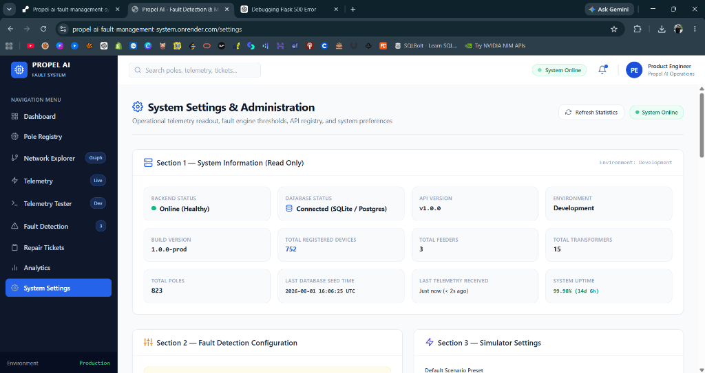

# Propel AI Fault Detection and Management System

A software system for modeling electrical distribution networks, ingesting IoT telemetry, localizing grid outages deterministically, and tracking repair ticket lifecycles.

---

## Public Deployment & Demo

- **Live System URL**: `https://propel-ai-fault-management-system.onrender.com`
- **Video Walkthrough**: `https://drive.google.com/drive/folders/19Q4dV5o6U9iq1BrJBG0qxe9Sup0egLnz?usp=sharing`

---

## Project Overview

Utility power distribution grids face challenges when detecting outages on 11kV lines. Standard operations often depend on manual customer telephone reports to find broken conductor spans or tripped transformers.

This application provides a structured approach for smart grid monitoring:
1. **Network Topology Graph**: Represents 11kV feeders, distribution transformers, line poles, and IoT devices in a bi-directional in-memory radial graph (`NetworkGraphService`).
2. **Telemetry Ingestion Engine**: Validates, deduplicates, and tracks sequence ordering of IoT pole telemetry payloads (`TelemetryIngestionService`).
3. **Deterministic Fault Localization**: Implements graph boundary search algorithms to isolate span breaks (`SPAN_FAULT`), transformer outages (`TRANSFORMER_FAULT`), and main feeder trips (`FEEDER_FAULT`) under 5 milliseconds.
4. **Confidence Scoring & Reasoning**: Calculates certainty scores (0–100%) based on network topology completeness, missing sensor gaps, and sequence lag, providing step-by-step diagnostic logic arrays.
5. **Automated Ticket Lifecycle**: Creates work orders automatically (`TKT-2026-XXXX`), enforces state machine rules (`NEW` → `ACKNOWLEDGED` → `ASSIGNED` → `RESOLVED` → `VERIFIED` → `CLOSED`), and verifies power restoration automatically against telemetry streams.
6. **Fault Simulator**: Allows operators to inject 8 real-time grid fault scenarios and verify power restoration flows.
7. **System Settings & Administration**: Provides an operational dashboard to view read-only telemetry, configure local thresholds, inspect REST endpoints, export configurations, and manage UI preferences.

---

## Application Screenshots

---

## Dashboard



The main monitoring dashboard providing a real-time overview of the electrical distribution network, including active faults, maintenance tickets, healthy devices, and live telemetry status.

---

## Pole Registry



Master registry containing all electrical poles, feeders, transformers, device associations, and network asset information with powerful search and filtering capabilities.

---

## Network Explorer



Interactive hierarchical network visualization that represents feeders, transformers, and pole relationships, enabling topology exploration and deterministic fault tracing.

---

## Live Telemetry



Real-time IoT telemetry monitoring page displaying incoming sensor data, power events, communication status, device health, and telemetry history.

---

## Telemetry Tester



Developer testing utility used to simulate telemetry events, inject faults, validate API behavior, test duplicate detection, sequence ordering, bulk ingestion, and fault propagation.

---

## Fault Detection



Deterministic fault localization engine that analyzes telemetry data to identify outage locations, estimate affected network segments, calculate confidence scores, and provide diagnostic explanations without using probabilistic AI reasoning.

---

## Repair Tickets



Automated maintenance ticket management system that creates, tracks, and monitors repair work orders generated from detected faults, including ticket priority, lifecycle status, engineer assignment, and restoration progress.

---

## Analytics



Operational analytics dashboard providing key performance indicators such as MTTR, network availability, outage statistics, telemetry trends, ticket distribution, simulator usage metrics, and exportable operational reports.

---

## System Settings



Administrative control panel for monitoring system health, configuring fault detection parameters, simulator settings, notification preferences, REST API endpoints, maintenance utilities, and overall platform configuration.

---

## Features

- **Pole Registry Index**: Master index supporting 800+ pole records with official CSV file import (`PoleRegistryImportService`), pincode filtering, and device linkages.
- **Telemetry Ingestion**: Ingests single and bulk telemetry payloads with duplicate rejection based on `(device_id, sequence_number)` pairs.
- **Network Topology Inspector**: Visualizes radial feeder lines, transformer hierarchies, parent-child pole chains, and operational device statuses.
- **Deterministic Outage Localization**: Identifies line breaks without non-deterministic AI language models, suppressing false positives when downstream poles remain energized.
- **Automated Work Orders**: Generates repair tickets and automatically transitions resolved tickets to verified status when telemetry confirms power restoration.
- **Scenario Simulator**: Interactive tool for simulating span faults, transformer trips, feeder outages, and sensor anomalies.
- **Analytics & Maintenance**: Generates grid MTTR metrics, availability percentages, CSV/JSON data exports, and configuration exports.

---

## Technology Stack

### Backend
- **Python**: 3.12
- **Framework**: Flask 3.0
- **ORM & Migrations**: SQLAlchemy 2.0, Flask-Migrate (Alembic)
- **Testing**: Pytest 8.3

### Frontend
- **Framework**: React 18.2, Vite 5.4
- **Styling**: Tailwind CSS 3.4
- **Icons & Routing**: React Icons 5.0, React Router DOM 6.22
- **HTTP Client**: Axios 1.6

### Database & Infrastructure
- **Development DB**: SQLite 3 (`dev.db`)
- **Production DB**: PostgreSQL 15 (Docker)
- **Containerization**: Docker, Docker Compose, Nginx

---

## Repository Structure

```text
Propel-ai-fault-management-system/
├── backend/
│   ├── app/
│   │   ├── config/          # Environment configuration & DB URIs
│   │   ├── database/        # SQLAlchemy instance & migration setup
│   │   ├── middleware/      # Error handlers & request logger
│   │   ├── models/          # ORM models (Feeder, Transformer, Pole, Device, Telemetry, Ticket)
│   │   ├── routes/          # REST API Blueprints (Health, Poles, Telemetry, Graph, Faults, Tickets, Simulator, Analytics)
│   │   ├── services/        # Core business logic services
│   │   └── tests/           # 43 automated unit tests
│   ├── migrations/          # Alembic database migration scripts
│   ├── Dockerfile           # Backend container build specification
│   └── run.py               # Flask application entry point
├── frontend/
│   ├── src/
│   │   ├── components/      # Modular UI components & cards
│   │   ├── layouts/         # Main layout wrapper & sidebar
│   │   ├── pages/           # Dashboard, Poles, Telemetry, Graph, Faults, Tickets, Simulator, Analytics, Settings
│   │   ├── routes/          # React Router configuration
│   │   └── services/        # Axios API client wrapper
│   ├── Dockerfile           # Frontend Nginx container build specification
│   └── vite.config.js       # Vite development server configuration
├── data/                    # Sample CSV files (sample_pole_registry.csv)
├── docs/                    # Additional guides and demo script documentation
├── scripts/                 # Seeding (seed_database.py), pole importer, and utility scripts
├── AI-WORKFLOW.md           # AI assistance & engineering workflow log
├── ARCHITECTURE.md          # System architecture, schemas, and sequence diagrams
├── DECISIONS.md             # Engineering decision log and trade-offs
├── DEPLOYMENT.md            # Local setup, Docker Compose, and operations guide
├── docker-compose.yml       # Production multi-container orchestration
└── README.md                # Project documentation index
```

---

## Environment Variables

Copy `.env.example` to `.env` in the project root:

```ini
# Flask Configuration
FLASK_ENV=development
SECRET_KEY=dev-secret-key-change-in-production
PORT=5000

# Database Configuration (SQLite default for local development)
DATABASE_URL=sqlite:///dev.db

# PostgreSQL Configuration (For Docker Compose)
POSTGRES_USER=postgres
POSTGRES_PASSWORD=postgres
POSTGRES_DB=propel_fault_db
POSTGRES_HOST=db
POSTGRES_PORT=5432

# Frontend Configuration
VITE_API_BASE_URL=http://localhost:5000/api/v1
```

---

## Quick Start with Docker Compose

To build and launch the entire stack (PostgreSQL, Flask Backend, Vite/Nginx Frontend):

```bash
docker-compose up --build
```

Access services at:
- **Frontend Dashboard**: `http://localhost:3000`
- **Backend API Base**: `http://localhost:5000/api/v1`
- **API Health Endpoint**: `http://localhost:5000/api/v1/health`

---

## Local Development Setup

### 1. Backend Setup

```bash
# Navigate to project root
cd Propel-ai-fault-management-system

# Create and activate virtual environment
python -m venv venv

# Windows:
venv\Scripts\activate
# Linux/macOS:
source venv/bin/activate

# Install backend dependencies
pip install -r backend/requirements.txt

# Seed SQLite database (Creates Feeders, Transformers, Poles, Devices)
python scripts/seed_database.py

# Run Flask backend server
python backend/run.py
```

Backend will start on `http://localhost:5000`.

### 2. Frontend Setup

```bash
# Open a new terminal window
cd frontend

# Install Node modules
npm install

# Start Vite dev server
npm run dev
```

Frontend will start on `http://localhost:3000`.

---

## Running Unit Tests

Automated tests cover model relationships, telemetry ingestion deduplication, deterministic fault localization algorithms, repair ticket state machine transitions, and CSV import logic:

```bash
python -m pytest backend/app/tests/
```

All 43 unit tests should pass cleanly.

---

## Documentation Index

- [Architecture Guide](ARCHITECTURE.md) — System design, graph representation, fault algorithms, and Mermaid diagrams.
- [Deployment Guide](DEPLOYMENT.md) — Local, Docker Compose, and production deployment procedures.
- [Engineering Decisions Log](DECISIONS.md) — Trade-offs, database selection, and algorithm choices.
- [AI Workflow & Prompts](AI-WORKFLOW.md) — AI usage, rejected code suggestions, and manual fixes.

---

## License

This project is open-source and available under the [MIT License](LICENSE).
